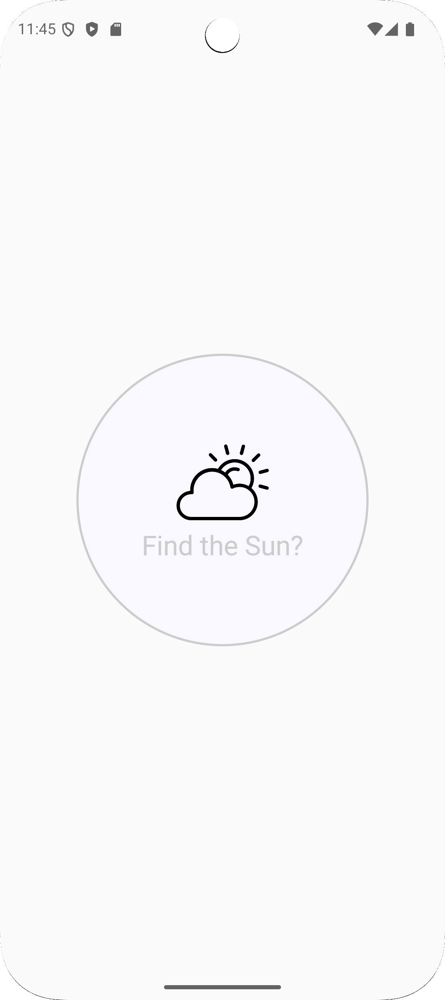
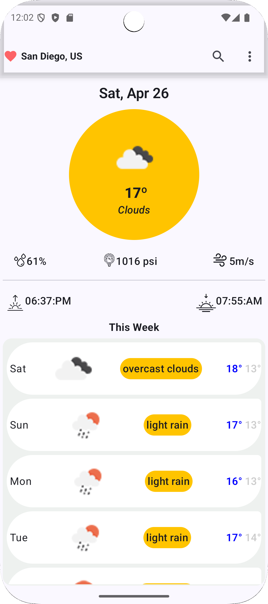
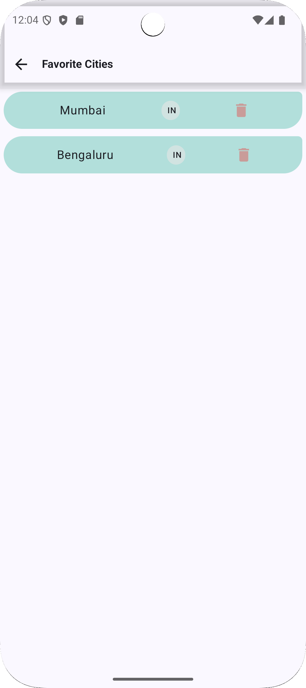
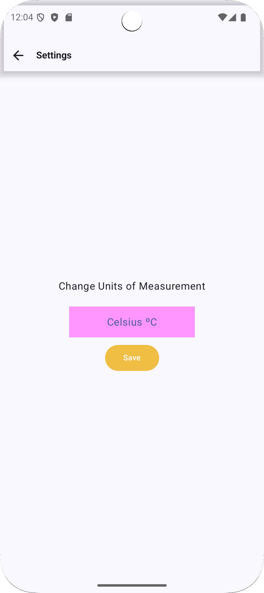
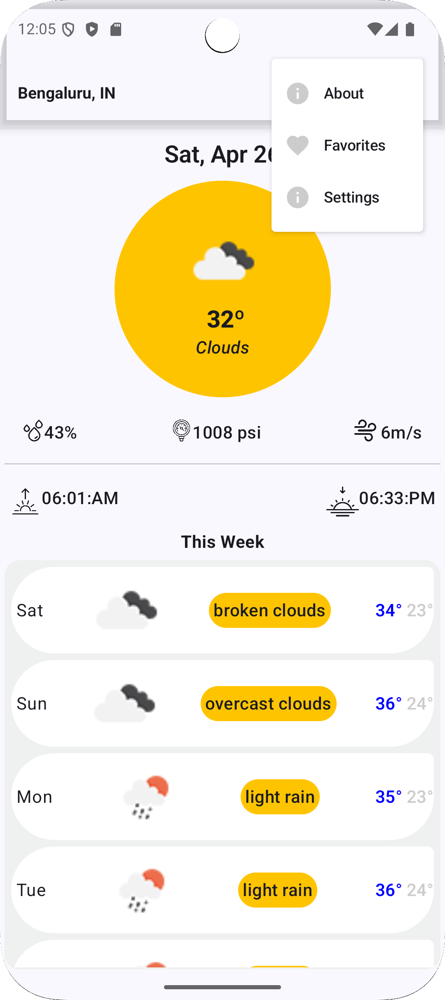

# JetWeatherForecast 🌦️

JetWeatherForecast is a modern weather forecasting app built with Kotlin and Jetpack Compose.  
It fetches real-time weather data using the OpenWeatherMap API, displays current and 7-day forecast details, and offers a clean, responsive UI.

## 🔥 Features

- 🌍 Fetch real-time weather data using **OpenWeatherMap API**.
- 🗺️ Search for any city to view detailed weather information.
- 💾 Save your favorite cities locally using **Room Database**.
- 🔥 Switch between **Celsius and Fahrenheit** in the **Settings Screen**.
- 🏡 Home Screen:
  - Top half: Circular UI displaying temperature, sunset, sunrise, wind speed, and humidity.
  - Bottom half: 7-day forecast showing weather trends for the week.
- 🛡️ Implemented **Hilt + Dagger** for clean and scalable dependency injection.
- 🧠 Followed **MVVM architecture** and **Repository pattern**.
- 🎨 Fully designed using **Jetpack Compose** with modern UI/UX practices.

## 🛠️ Built With

- Kotlin
- Jetpack Compose
- Hilt / Dagger
- Room Database
- Retrofit
- OpenWeatherMap API
- MVVM Architecture

## 📸 Screenshots

<table>
  <tr>
    <td></td>
    <td></td>
    <td></td>
    <td></td>
    <td></td>
  </tr>
  <tr>
    <td>
Splash
</td>
    <td>
Home
</td>
    <td>
Favorites
</td>
    <td>
Settings
</td>
    <td>
Menu
</td>
  </tr>
</table>
## 📂 Installation

1. Clone the repository
2. Open in Android Studio
3. Add your OpenWeatherMap API Key to `constants.kt`
4. Run the app on your device or emulator
